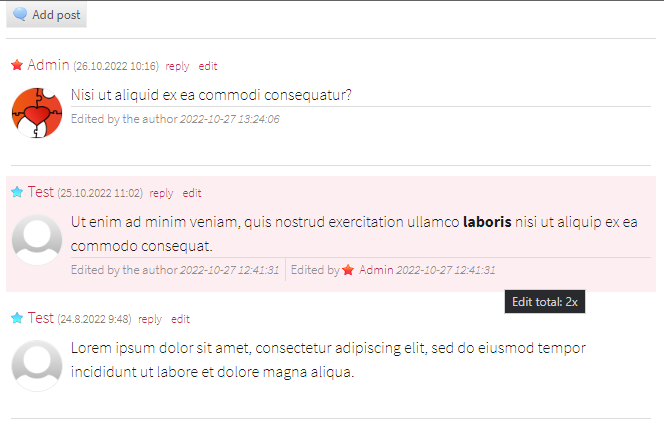

Post Edit Info
########

Information about editing a post.

.. contents::
   :depth: 2

Requirements
************

- SunLight CMS 8

Installation
************

::

    Copy the folder 'plugins' and its contents to the root directory

or

::

    Installation via administration: 'Administration > Plugins > Upload new plugins'

Features
********

- adds editing information after the content of the post.
- distinguishes between editing by the author and by another user.
- counts the total number of edits
- add comparison of original and submitted text (no changes - don't save)

Extend events
=============

``plugin.posteditinfo.before``
------------------------------

Called before compiling post editing information.

Arguments:

- ``item`` - associative array with post data
- ``info`` - references to an associative array with information about editing the post (modifiable)
- ``output`` - value to be rendered into the post (modifiable)

``plugin.posteditinfo.after``
-----------------------------

Called before compiling post editing information.

Arguments:

- ``item`` - associative array with post data
- ``info`` - associative array with information about editing the post
- ``output`` - value to be rendered into the post (modifiable)

Preview
*******

